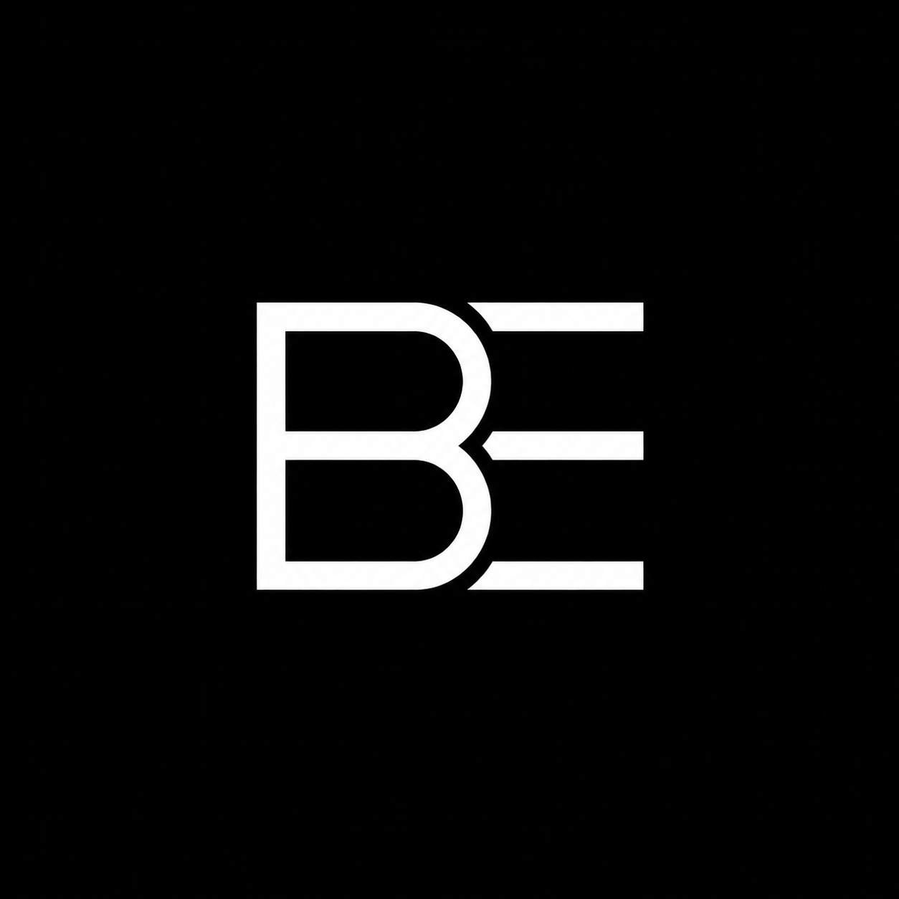

#  Banx Engineering

> **Inventive. Precise. Curious. Professional.**

## 🌐 Connect

## 🏗️ Currently Building
* **Pro Audio Hardware:** Custom MIDI instruments and Rust-based audio engines.
* **Automated Prototyping:** Custom PCB design and automated 3D-printed assembly.
* **Techpreneur News:** Insights on the intersection of engineering and business.

## 💻 Tech Stack
### Software Architecture

### Hardware & Prototyping

## 📊 Performance Metrics

  
  

---

